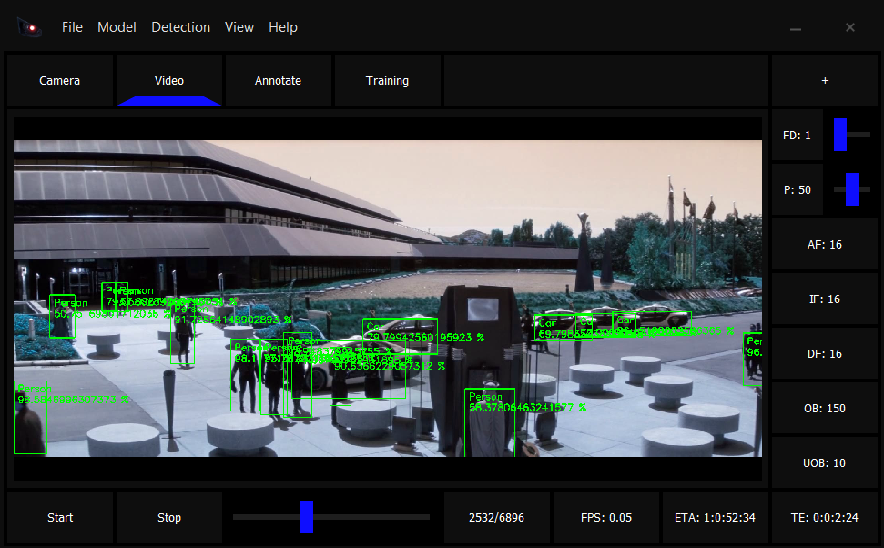
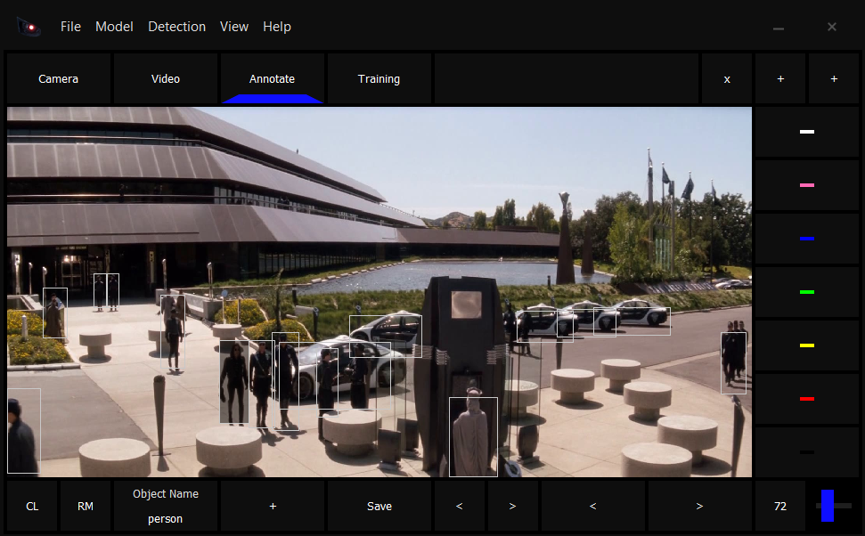
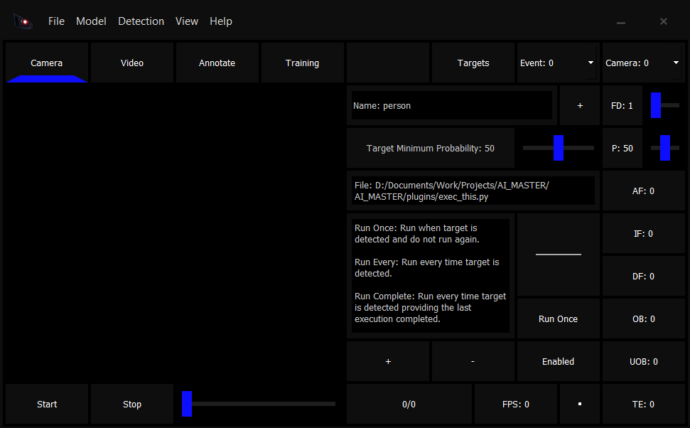

Detectionator (Object Detection Studio using ImageAI)

-----

Detectionator is an Object Detection Studio for ImageAI, using a highly modified
version of the original ImageAI.

This software is a toolkit for training models annotating/auto-annotating images
from videos/cameras and ultimately detection of objects with target events that
can be triggered upon target detection using YOLOv3 or a custom model.

Detection, auto-annotation, manual annotation, training. Teach it what anything
is, even aliens and UAPs and setup corresponding target events.

-----

Download:

    https://drive.google.com/drive/folders/1wAuqcOAUPCxYI9UWFH4erdGI21U_LVY6?usp=sharing

-----

[ Camera ]

Plug & play object detection and auto annotation from live camera feeds.
Target detection with half a million fully programmable target events for
specified targets.
Created data-sets can be used for further annotation and training.

-----

[ Video ]

Object detection and auto annotation from video files to create data-sets
that can be used for further annotation and training.

-----

[ Annotation ]

A. Annotate a single image file. (Select a file).

B. Annotate a directory of image files. (Select a directory containing images).

C. Edit existing annotation files in a dataset. (Select a directory containing
annotation & images directories).

If the dataset was created by this software's auto-annotator, then in Annotation
open image directory as the location created during auto-annotation, directory 'auto',
auto is the directory that should be selected if opening a dataset for annotation,
then this software will be able to find both images and annotation directories within.

Existing annotation(s) will be loaded in with the corresponding images and displayed
with bounding boxes. The existing object name(s) can be edited/removed and new objects
can be added too.

Be sure to set the save location (File -> Save Location) to the annotation directory
for the image directory being annotated.

Existing auto/previously annotated objects can be renamed or removed entirely and new
objects can be annotated too.

-----

[ Training ]

Ensure dataset directory structure is correct before initiating training. Auto annotation
will not create the training/validation directory for you, only annotation and images
directories which would have to be split approximately 70+% training and 30+% validation.

Ensure datasets are accurate either because a dataset not created by this program is
trusted or because a dataset created by this program has been manually checked/annotated.

Directory containing dataset should be in the following structure:

                     |--------------> annotations
                 train
                 |   |--------------> images
    hololens --->
                 |   |--------------> annotations
                validation
                     |--------------> images
    
    
                     |--------------> annotations
                 train
                 |   |--------------> images
    oculus ----->
                 |   |--------------> annotations
                validation
                     |--------------> images

Train from scratch or train from pre-trained model, select a dataset and hit train.

-----

[ Target Events ]

A minimal knowledge of python is required to write a target event.

Welcome to the 'detenator' if you will...

Either using YOLOv3 or a model trained on new objects it is ultimately time
to setup target events. For performance reasons, currently a target event can be
set as a file.

Execution Modes:

1: Run once when a target is detected.

2: Run every time a target is detected.

3: Run every time a target is detected providing previous execution completed.

-----

[ GUI ]

    FD:  Frame detection interval.
    P:   Minimum percentage probability.
    AF:  Annotation files.
    IF:  Image files.
    DF:  Detection files.
    OB:  Objects.
    UOB: Unique objects.
    TE:  Time elapsed.

    CL: Clear all object annotations for the current image.
    RM: Remove annotation for the currently selected object.

-----

[ Bugs ]

BETA stage however application is mostly stable and will
require crash testing to make more stable by finding issues as
they arise, are found.

-----

[ Versions ]

    Python: 3.7.
    ImageAI: Uses old Imageai backend.
    Plugins: Should be made to be compaitble with Python 3.7.

-----

[ Creator ]

    Written by Benjamin Jack Cullen

    Although this software uses a highly modified and upgraded ImageAI it is
    thanks to ImageAI that this software exists at all and my mods/upgrades are
    simple in comparison and exist only to allow for more functionality in
    specific areas of ImageAI.

    Source code may be available on request however not many things auto-annotate
    and if they do they cost money and i really need money.

-----

[ PayPal ]
    
    benjaminjc173@gmail.com :)

-----